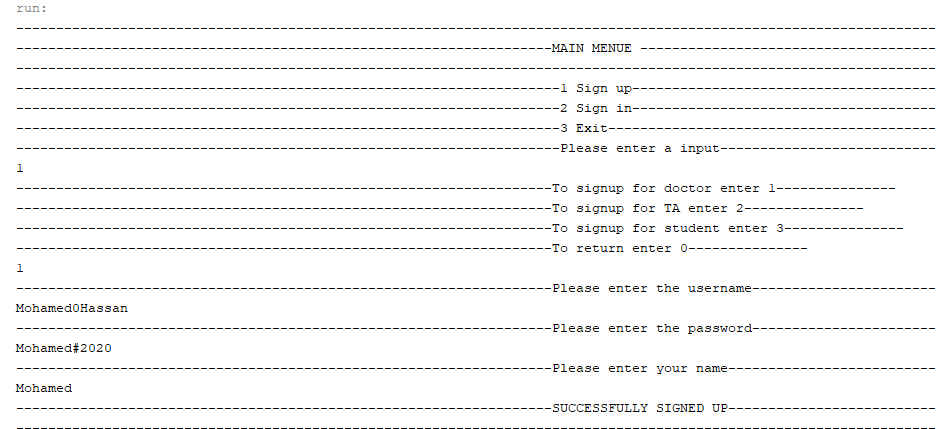
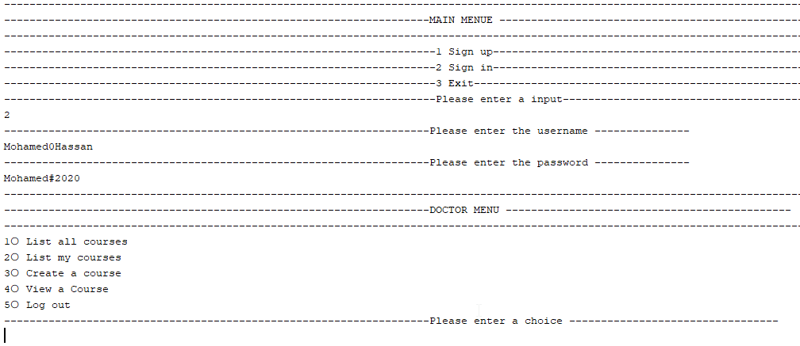
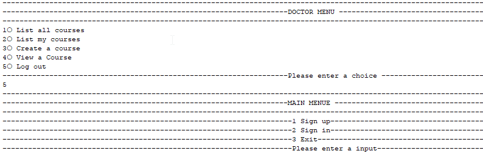

<h1>Educational Management System</h1>
<h3>It is a software for managing the education process, that anyone can create an account to instruct a course or to be a teacher assistant or even to 
learn some courses</h3>

<h2>Main Menu</h2>

<h3>Signup</h3>
<h4>There are three categories of signing up for a doctor account, student or teacher assistant
There are constraints for username and the password that the program check the regex validation</h4>

  

<h3>Login</h3>
<h4>When the user login the program check each type of account is to create an object to view his menu
All the passwords between the database and the program are hashed using a simple hashing algorithm</h4>

  

<h3>Doctor Menu</h3>

<h4>List all the courses</h4>
<h5>The doctor can see all the courses on the site</h5>

  

<h4>List my courses</h4>
<h5>That the doctor can view the courses which he teaches</h5>

  

<h4>Create a course</h4>
<h5>That the doctor can create a course to teach</h5>

  

<h4>Full view for a course</h4>
<h5>The doctor can manage his courses within view a specific course</h5>

  

<h3>Course Menu for doctor</h3>
<h4>This list shows in a special way for the doctor who is the instructor of the course</h4>

  

<h4>View the mark report of the course</h4>
<h5>This method shows all students in the course with their grade details</h5>

  

<h4>View the assignments in the course</h4>
<h5>This method shows all the assignments in the course name with the assignment code</h5>

  

<h4>Create an assignment</h4>
<h5>To enable the doctor from creating a new assignment</h5>

  

<h4>Full View for a specific assignment with its code</h4>
<h5>To manage and see the details, submissions of the assignment</h5>

  

<h3>Assignment Menu</h3>

  

<h4>The assignment mark report</h4>
<h5>It shows the the students status in the assignment with their marks</h5>

  

<h4>Viewing the assignment submissions</h4>
<h5>Shows the the students submission answers in the choosen assignment</h5>

  

<h4>Editing  the assignment questions</h4>
<h5>It replaces the old questions with the new input questions</h5>

  

<h4>Viewing the assignment info</h4>
<h5>It shows full overview about the assignment</h5>

  

<h4>Remov the assignment</h4>
<h5>it removes the assignment from the whole database</h5>

  

<h4>Add a student</h4>
<h5>it shows list with all the students in the site with their names and IDs to choose from</h5>

  

<h4>Remove a student</h4>
<h5>it shows list with the students who are registered in the course with their names and IDs to choose from to remove</h5>

  

<h4>Add a teacher assistant</h4>
<h5>It shows list with the all the teacher assistants in the site with their names and IDs to choose from to add</h5>

  

<h4>Remave a teacher assistant</h4>
<h5>It shows list with the teacher assistants who are teaches the course with their names and IDs to choose from to remove</h5>

  

<h4>Log out</h4>
<h5>The user can go to logout by following the process in the picture</h5>

  

<h3>Student Menu</h3>
<h4>The Menu contains many operations that the student can do in the site</h4>

  

<h4>Registering in a course</h4>
<h5>The first operation, the student can view all the courses in the site and choose on of them to register in</h5>

  

<h4>Student's courses</h4>
<h5>When the the user choose to view his courses that he registered in</h5>

  

<h4>View some course</h4>
<h5>The user can view the complete course information and perform operations by entering the course code and show a menu with the operations</h5>

  

<h4>Student mark report in the choosen course</h4>
<h5>This operation shows the student marks in different parts of the course that are saved in the database</h5>

  

<h4>Course's assignments</h4>
<h5>It shows a list wiht the assignments (code, title) in the course</h5>

  

<h4>View assignments</h4>
<h5>The student can choose to view a specific assignment by entering the assignment code to do many operations in that assignment</h5>

  

<h4>View the assignment questions</h4>
<h5>The student see the assignment questions to solve the assignment</h5>

  

<h4>Submitting an answer</h4>

  

<h4>Viewing the student answer</h4>

  

<h4>View the assignment mark</h4>

  
